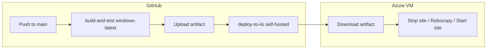

# CD with a self-hosted runner (Azure VM / IIS)

This guide walks you through continuous deployment for **SATI.NET** after you have registered a **Windows self-hosted runner** on your server. For installing the runner (download, `config.cmd`, service), see [github-actions-self-hosted-runners.md](./github-actions-self-hosted-runners.md).

## What you get

- **Push to `main`** runs: build and tests on GitHub-hosted Windows, then deploys the built website to your IIS folder **on the VM** (only if build and tests succeed).
- **`workflow_dispatch`** lets you run the same pipeline manually from the Actions tab.

The workflow file is [`.github/workflows/cd.yml`](../.github/workflows/cd.yml).

## Prerequisites

| Item | Notes |
|------|--------|
| Runner online | **Settings → Actions → Runners** shows idle (green). Prefer `C:\actions-runner` and run as a **Windows service** (`svc.cmd install` / `start`), not only `run.cmd`. |
| Default labels | Windows runners get `self-hosted`, `Windows`, and `X64`. The template uses `runs-on: self-hosted`. If you add custom labels (e.g. `production`), change `runs-on` in `cd.yml` to match. |
| Build tools on GitHub CI | Unchanged: NuGet, MSBuild, VSTest on `windows-latest`. |
| IIS on the VM | Site created; you know the **site name** in IIS and the **physical path** (e.g. `C:\inetpub\wwwroot\YourSite`). |
| Permissions | The account running the runner service can **write** to the IIS physical path and **start/stop** the site (WebAdministration / IIS). |

## Step 1: Runner service (production)

On the VM (Administrator PowerShell):

```powershell
cd C:\actions-runner
.\svc.cmd install
.\svc.cmd start
.\svc.cmd status
```

Confirm the runner appears **Idle** in GitHub. If you use a custom service account, grant it **Log on as a service**, write access to the deploy folder, and IIS rights as needed.

## Step 2: Repository variables (deploy target)

In the GitHub repo: **Settings → Secrets and variables → Actions → Variables** → **New repository variable**

| Name | Example | Purpose |
|------|---------|---------|
| `DEPLOY_IIS_PATH` | `C:\inetpub\wwwroot\SatiDotNet2` | Folder IIS serves for the app (no trailing slash required). |
| `DEPLOY_SITE_NAME` | `Default Web Site` or your site name | Passed to `Stop-WebSite` / `Start-WebSite`. |

Until both are set, the deploy job fails with an error that tells you to configure them.

**Optional:** If production `web.config` must never be overwritten from GitHub, edit the deploy step in `cd.yml` to add Robocopy `/XF web.config` or sync everything except that file (see comments in the workflow).

## Step 3: Branch and triggers

- Deploy runs on **push to `main`** (not on pull requests). Opening a PR still uses [`.github/workflows/ci.yml`](../.github/workflows/ci.yml) only.
- To test without pushing, use **Actions → CD (self-hosted IIS) → Run workflow**.

## Step 4: First run

1. Merge or push to `main`.
2. Open **Actions**, select **CD (self-hosted IIS)**.
3. Confirm the first job (**build-and-test**) succeeds on `windows-latest`.
4. Confirm the second job (**deploy-to-iis**) runs on **self-hosted** and completes.

If **deploy** is queued forever, the runner is offline or labels do not match (`runs-on`).

## How the pipeline works



1. **build-and-test** — Checkout, NuGet restore, `msbuild` `SatiDotNet2/SatiDotNet2.sln` Release, VSTest on `SatiDotNet2Tests`, then stage `SatiDotNet2` (excluding `obj`, `.vs`) and upload an artifact.
2. **deploy-to-iis** — Runs only on `self-hosted`. Downloads the artifact, stops the IIS site, mirrors files into `DEPLOY_IIS_PATH`, starts the site again.

## Troubleshooting

| Symptom | What to check |
|---------|----------------|
| Runner offline | Service running, outbound HTTPS to GitHub, logs under `C:\actions-runner\_diag`. |
| Access denied on deploy | Runner service account permissions on `DEPLOY_IIS_PATH` and IIS. |
| Wrong site updated | `DEPLOY_SITE_NAME` and `DEPLOY_IIS_PATH` must match the intended IIS site. |
| Robocopy exit code | Robocopy uses bitmask exit codes; the workflow treats `> 7` as failure. |
| Tests fail only on CI | Same as today: fix tests or paths; deploy does not run if this job fails. |

## Alternative: build entirely on the VM

If you want the same MSBuild/VSTest stack as production, you can use a single job with `runs-on: self-hosted` (build, test, deploy in one place). Trade-offs: you must install Build Tools + VSTest on the VM, and you lose the “artifact handoff” between GitHub and the server. The provided `cd.yml` avoids that by building on `windows-latest` and only copying outputs to the VM.

## References

- [Using self-hosted runners in a workflow](https://docs.github.com/en/actions/hosting-your-own-runners/managing-self-hosted-runners/using-self-hosted-runners-in-a-workflow)
- [Storing information in variables](https://docs.github.com/en/actions/learn-github-actions/variables)
- [Uploading workflow artifacts](https://docs.github.com/en/actions/using-workflows/storing-workflow-data-as-artifacts)
